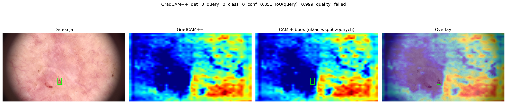
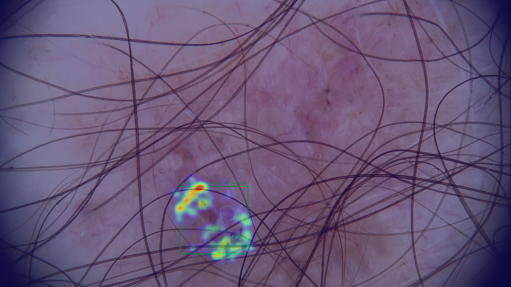
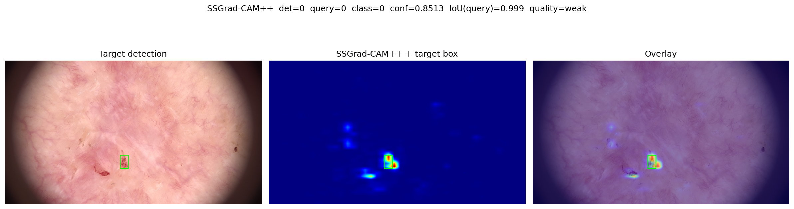
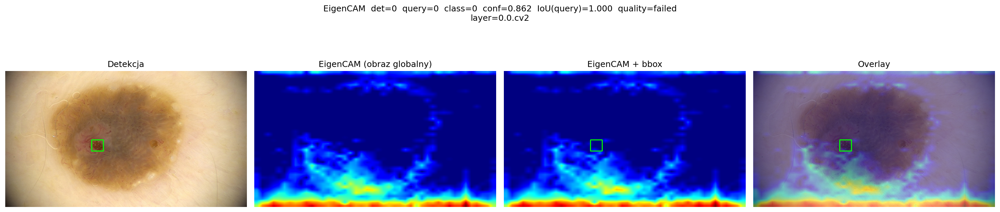

# Wyjaśnialność modeli detekcji struktur dermatoskopowych (XAI)

**Autor:** Bartłomiej Ruszaj, nr indeksu: 266480

**Temat:** własny — wyjaśnialność **detekcji** struktur dermatoskopowych w kontekście transparentności diagnostycznej i regulacji AI

**Kurs:** Aspekty prawne, społeczne i etyczne w AI, PWr 2025/2026

> Lista tematów: [Zasady zaliczenia — Menu mini-projektów](https://github.com/laugustyniak/ai-ethics-law-course/blob/main/Zasady%20zaliczenia.md#menu-mini-projekt%C3%B3w)

---

## Quick Start

```bash
uv sync --extra notebooks --extra rfdetr-xai
.venv/bin/jupyter notebook notebooks/
```

W **notebookach** ustawiasz ścieżki do checkpointu RF-DETR, JSON COCO i katalogu obrazów (checkpoint z pipeline’u **`dermatoscopy_ai`**, klasa *yellow globules* — patrz [Uruchomienie](#uruchomienie)).

Szczegóły zapisanych wyników: [notebooks/WNIOSKI_ANALIZA_NOTEBOOKOW_XAI.md](notebooks/WNIOSKI_ANALIZA_NOTEBOOKOW_XAI.md). Szerszy kontekst techniczny (w tym moduły w `src/`): [EXPERIMENTS.md](EXPERIMENTS.md).

---

## USAGE — reprodukcja dla zespołu (drugie repo, PLGrid, dane)

Ten mini-projekt (**XAI / notebooki**) jest powiązany z osobnym repozytorium treningowym:

- **[`bmruszaj/dermatoscopy_ai`](https://github.com/bmruszaj/dermatoscopy_ai)** — trening **RF-DETR**, przygotowanie adnotacji w formacie **COCO**, skrypty i zależności do przetwarzania danych detekcji.  
  **Repozytorium jest prywatne** — wejście wymaga **nadania dostępu** (np. zaproszenie do współpracy). Nie jest to warunek formalny samego mini-projektu kursowego, ale **ułatwienie dla zespołu**, żeby powtórzyć pełną ścieżkę: dane → trening → checkpoint → notebooki XAI w tym repo.

**Zbiór danych (etykiety / dostęp do obrazów)** jest hostowany poza GitHubem, na **prywatnym** portalu: [https://oldtown.digitalcloud.cc/](https://oldtown.digitalcloud.cc/) (Old Town Clinic / chmura — dostęp wg umowy zespołu z kliniką).

**PLGrid (ACK Cyfronet)** — skrypt ustawiający na klastrze moduły `GCCcore` / `Python 3.13`, **uv**, wirtualne środowisko i `uv sync` dla klonu `dermatoscopy_ai` w katalogu roboczym (`$SCRATCH`):

- w tym repo (kopia dokumentacyjna): [`scripts/plgrid/setup_uv_py313_dermatoscopy_ai.sh`](scripts/plgrid/setup_uv_py313_dermatoscopy_ai.sh)  
- kanoniczna ścieżka w repo treningowym: `dermatoscopy_ai/scripts/setup_uv_py313.sh`

Przed uruchomieniem na PLGrid **dostosuj** w skrypcie zmienne `ROOT_DIR`, `PROJECT_DIR` i ewentualnie `UV_BIN_DEFAULT` do swojego loginu i lokalizacji klonu. Uruchomienie: `bash scripts/plgrid/setup_uv_py313_dermatoscopy_ai.sh` (z węzła interaktywnego lub jako krok w jobie, po `module load` zgodnie z polityką klastra).

**To repo (mini-projekt)** nadal uruchamiasz lokalnie lub na maszynie z GPU przez `uv sync --extra notebooks --extra rfdetr-xai` i Jupyter — patrz [Quick Start](#quick-start). Skrypt PLGrid dotyczy przede wszystkim **środowiska treningowego** w `dermatoscopy_ai`.

---

## Checklist oddania (wymagania formalne)

Zgodnie z [ZASADY_ZALICZENIA_MINI_PROJEKT.md](docs/context/ZASADY_ZALICZENIA_MINI_PROJEKT.md) — przed terminem sprawdź:

| Wymaganie | Status (uzupełnij) |
|-----------|-------------------|
| **Temat** ustaliłeś z prowadzącym na zajęciach i masz **potwierdzenie** (bez tego mini-projekt nie podlega ocenie) | ☐ |
| Na **GitHub** zaprosiłeś prowadzącego (**[`laugustyniak`](https://github.com/laugustyniak)**) do repozytorium z **dostępem** (link bez dostępu ≠ oddanie) | ☐ |
| W repo są **kod** (`src/`, `notebooks/`), **opis** (`README.md`, `PROCESS.md`) i **efekty pracy** (min. zacommitowane `wyniki/notebook_xai_przyklady/` i/lub `wyniki/xai_demo/`; większe eksperymenty lokalnie + opis reprodukcji) | ☐ |
| **README:** cel, uruchomienie, wnioski merytoryczne, **czego projekt nie robi** | ☐ |
| **PROCESS:** narzędzia GenAI, **rzeczywiste prompty** (bez wklejania outputu modeli), decyzje, co nie zadziałało | ☐ |
| **Powiązanie z projektem grupowym** — uzupełnione w README (nawet krótko: ten sam zbiór / ten sam model / wspólna etyka wdrożenia) | ☐ |

**Środowisko:** `requires-python` w `pyproject.toml` to **Python 3.13**; zależności są zsynchronizowane ze stackiem z sąsiedniego repozytorium **`dermatoscopy_ai`** (PyTorch **+cu128**, `rfdetr`, itd.). **Praca z repozytorium:** `uv sync` + Jupyter z katalogu `.venv` (patrz [Quick Start](#quick-start)).

---

## Cel projektu

Projekt bada i demonstruje **wyjaśnialność detekcji** (RF-DETR + metody XAI) na dermatoskopii, z metrykami lokalizacji wyjaśnień (m.in. EBPG, mIoU, Δp). Łączy wyniki techniczne z **transparentnością** diagnostyczną, i ograniczeniami „wyjaśnień” w medycynie, bez udawania, że mapa saliencji zastępuje walidację kliniczną.

---

## Powiązanie z projektem grupowym

Projekt zespołowy polega na stworzeniu platformy edukacyjnej dotyczącej wykrywania struktur dermatoskopowych. Zbiór danych jest dostępny w ramach współpracy z kliniką specjalistyczną Old Town Clinic. Projekt zawiera wytrenowanie modelu RFDetr. Moja magisterka przedstawia wyjaśnialność modelu detekcji struktur dermatoskopowych a projekt jest częścią eksploracyjną jakie metody będą działać, przeprowadzając eksperymenty na ograniczonej ilości zdjęć i tylko na jednej strukturze.

---

## Wymagania

### Oprogramowanie i sprzęt

| Element | Uwagi |
|--------|--------|
| **Python** | **3.13** (zakres `requires-python` w `pyproject.toml`). |
| **[uv](https://docs.astral.sh/uv/)** | Instalacja zależności i odtwarzanie wersji z `uv.lock`. |
| **GPU + CUDA** | Główna ścieżka RF-DETR / PyTorch w tym repo to build **+cu128** (jak w `dermatoscopy_ai`). Bez GPU część eksperymentów będzie niepraktyczna lub wymaga innego profilu torch (poza tym `pyproject.toml`). |
| **Sieć / indeksy** | `uv sync` pobiera pakiety z PyPI oraz indeksu PyTorch (`cu128`). W środowiskach z proxy lub blokadą PyPI instalacja może wymagać maszyny z pełnym dostępem albo współdzielonego venv z `dermatoscopy_ai` — patrz też `PROCESS.md` (*Co nie zadziałało*). |

### Model i dane (ścieżka dermatoskopii)

Do **baseline’u, CAM, D-RISE i metryk na RF-DETR** potrzebujesz **wytrenowanego checkpointu** na klasie ***yellow globules*** oraz **COCO + obrazy** z pipeline’u repozytorium **`dermatoscopy_ai`** (tam trening i przygotowanie adnotacji). W tym repozytorium nie ma pełnego datasetu ani treningu — **eksperymenty prowadzisz w notebookach** (`notebooks/`). Szczegóły ścieżek: sekcja [Uruchomienie](#uruchomienie) oraz [notebooks/WNIOSKI_ANALIZA_NOTEBOOKOW_XAI.md](notebooks/WNIOSKI_ANALIZA_NOTEBOOKOW_XAI.md).

### Instalacja zależności (`uv`)

```bash
# Instalacja uv (jeśli nie masz)
curl -LsSf https://astral.sh/uv/install.sh | sh

# Rdzeń: PyTorch +cu128, rfdetr, COCO stack, … + grupa dev (pytest, ruff)
uv sync

# Notebooki Jupyter
uv sync --extra notebooks

# CAM (EigenCAM, GradCAM++), D-RISE, supervision — zależności używane z notebooków
uv sync --extra rfdetr-xai
```

**Minimalnie pod ten mini-projekt (same notebooki):**

`uv sync --extra notebooks --extra rfdetr-xai`

Grupa **`--extra xai`** (scipy) jest **opcjonalna** — tylko jeśli któryś notebook lub komórka jej wymaga.

Po synchronizacji uruchamiasz **Jupyter** z tego środowiska, np. `.venv/bin/jupyter notebook notebooks/`.

### Zmienne środowiskowe

Do opisanej ścieżki **notebookowej** klucze API **nie są potrzebne**. Plik `.env` ma sens wyłącznie, jeśli osobno uruchamiasz **przykłady API** z szablonu kursu w `src/example_*.py` (`cp .env.example .env` i uzupełnij klucze).

### Dokumentacja kontekstowa (`docs/context/`)

| Plik | Treść |
|------|--------|
| [PROPONYCJA_PROJEKTU.md](docs/context/PROPONYCJA_PROJEKTU.md) | Cel badawczy, RF-DETR, etyka / AI Act |
| [METODY_WYJASNIALNOSCI_XAI.md](docs/context/METODY_WYJASNIALNOSCI_XAI.md) | LeGrad, Chefer, RISE |
| [EWALUACJA.md](docs/context/EWALUACJA.md) | Pointing Game, Energy IoU, Insertion/Deletion AUC |
| [ZASADY_ZALICZENIA_MINI_PROJEKT.md](docs/context/ZASADY_ZALICZENIA_MINI_PROJEKT.md) | 100 pkt, terminy, zaproszenie `laugustyniak` |
| [RF_DETR_PREDICTIONS_FORMAT.md](docs/context/RF_DETR_PREDICTIONS_FORMAT.md) | Plan formatu predykcji detektora (JSON) pod porównanie z XAI |

---

## Uruchomienie

### Wymaganie wstępne: checkpoint RF-DETR (jedna struktura)

Notebooki zakładają **gotowy, wytrenowany model RF-DETR** na **jednej klasie: *yellow globules***. **Trening, COCO i checkpoint** przygotowujesz w **`dermatoscopy_ai`**. W komórkach notebooków podajesz ścieżki do:

- pliku checkpointu (np. `best_model.pt` / `checkpoint_best_ema.pth`),
- JSON COCO z bboxami,
- katalogu z obrazami.

### Instalacja i start

```bash
uv sync --extra notebooks --extra rfdetr-xai
.venv/bin/jupyter notebook notebooks/
```

Kolejność pracy: od [01_environment_setup.ipynb](notebooks/01_environment_setup.ipynb), potem m.in. [02_baseline_eval.ipynb](notebooks/02_baseline_eval.ipynb) i dalsze według tabeli poniżej. **Baseline** (mAP itd.) w tym zapisie liczony jest **w notebooku `02`**, nie z osobnego CLI.

**Notebooki:**

| Notebook | Temat |
|----------|--------|
| [01_environment_setup.ipynb](notebooks/01_environment_setup.ipynb) | środowisko |
| [02_baseline_eval.ipynb](notebooks/02_baseline_eval.ipynb) | baseline |
| [03_gradcam_analysis.ipynb](notebooks/03_gradcam_analysis.ipynb) | GradCAM++ (eksploracja; por. WNIOSKI) |
| [04_drise_analysis.ipynb](notebooks/04_drise_analysis.ipynb) | D-RISE |
| [04_v3_attention_evidence_map.ipynb](notebooks/04_v3_attention_evidence_map.ipynb) | Attention Evidence Map |
| [05_gradcampp.ipynb](notebooks/05_gradcampp.ipynb) | GradCAM++ (implementacja w notebooku) |
| [06_eigencam.ipynb](notebooks/06_eigencam.ipynb) | EigenCAM |
| [07_SSGradpp.ipynb](notebooks/07_SSGradpp.ipynb) | SSGrad-CAM++ |
| [rfdetr_xai_gradcam.ipynb](notebooks/rfdetr_xai_gradcam.ipynb) | szablon CAM / ścieżki wyjścia |

Podsumowanie wniosków z zapisu: [notebooks/WNIOSKI_ANALIZA_NOTEBOOKOW_XAI.md](notebooks/WNIOSKI_ANALIZA_NOTEBOOKOW_XAI.md).

**Repozytorium `dermatoscopy_ai`:** trening RF-DETR na **yellow globules**, foldy danych; tutaj **nie trenujesz od zera**. Moduły wywoływane z notebooków leżą w **`src/`** (ładowanie modelu, CAM, D-RISE, metryki).

**Pakiety PyPI (używane przez notebooki):** Grad-CAM — [`grad-cam`](https://github.com/jacobgil/pytorch-grad-cam); D-RISE — [`vision-explanation-methods`](https://github.com/microsoft/vision-explanation-methods).

**Uwaga metodologiczna:** jeśli ewaluujesz na **zbiorze treningowym**, metryki detekcji bywają **optymistyczne** — opisz w pracy, jaki split faktycznie używasz (patrz komentarze w `02` i WNIOSKI).

---

## Wyniki

> **Źródło liczb:** poniższe wartości pochodzą z **zapisanych wyjść** notebooków w katalogu [`notebooks/`](notebooks/) (szczegółowa tabela i kontekst: [notebooks/WNIOSKI_ANALIZA_NOTEBOOKOW_XAI.md](notebooks/WNIOSKI_ANALIZA_NOTEBOOKOW_XAI.md)). Wspólny setup: checkpoint RF-DETR *large*, COCO po deduplikacji (**~217 obrazów**), fokus na kategorii zgodnej z modelem (**1 klasa detekcji**, w anotacjach 10 etykiet — raportowana klasa m.in. „Yellow globules (ulcer)” w logu `02`). Po **ponownym uruchomieniu** notebooków liczby mogą się nieznacznie różnić (seed, progi, wersje bibliotek).

**Artefakty graficzne** do README: [`wyniki/notebook_xai_przyklady/`](wyniki/notebook_xai_przyklady/) — kopie z zapisu notebooków. **Wyjścia z ponownego uruchomienia** zapisujesz do katalogów ustawionych w komórkach (np. `wyniki/rfdetr_baseline/`, `wyniki/rfdetr_xai/`, …).

### Przykładowe wizualizacje (`wyniki/notebook_xai_przyklady/`)

| Notebook | Plik (ścieżka względem korzenia repo) |
|----------|--------------------------------------|
| [05_gradcampp.ipynb](notebooks/05_gradcampp.ipynb) | [`wyniki/notebook_xai_przyklady/05_gradcampp_img0_det0_q0.png`](wyniki/notebook_xai_przyklady/05_gradcampp_img0_det0_q0.png) |
| [04_v3_attention_evidence_map.ipynb](notebooks/04_v3_attention_evidence_map.ipynb) | [`wyniki/notebook_xai_przyklady/04v3_attention_overlay.png`](wyniki/notebook_xai_przyklady/04v3_attention_overlay.png) |
| [07_SSGradpp.ipynb](notebooks/07_SSGradpp.ipynb) | [`wyniki/notebook_xai_przyklady/07_ssgradcampp_img0_det0_q0.png`](wyniki/notebook_xai_przyklady/07_ssgradcampp_img0_det0_q0.png) |
| [06_eigencam.ipynb](notebooks/06_eigencam.ipynb) | [`wyniki/notebook_xai_przyklady/06_eigencam_img029_det0_q0.png`](wyniki/notebook_xai_przyklady/06_eigencam_img029_det0_q0.png) |









### Metryki i obserwacje z notebooków

| Notebook | Co raportuje (skrót) | Wybrane liczby z zapisu |
|----------|---------------------|-------------------------|
| [02_baseline_eval.ipynb](notebooks/02_baseline_eval.ipynb) | mAP COCO (klasa zgodna z checkpointem) | **mAP@[0.50:0.95] ≈ 0.646**, **mAP@0.50 ≈ 0.955**; AP small / medium / large ≈ **0.306 / 0.611 / 0.738**; **AR** (maxDets=100, all) ≈ **0.679** |
| [04_drise_analysis.ipynb](notebooks/04_drise_analysis.ipynb) | D-RISE, zbieżność map vs liczba masek | Korelacja Pearsona między budżetami masek (64→128→256): **≈ 0.787** (128 vs 64), **≈ 0.888** (256 vs 128); `matched_detection_rate` **~0.72–0.88** (128 masek); energia w bboxie **~0.086–0.49** między detekcjami na jednym obrazie *(przykładowe PNG D-RISE nie są w `wyniki/notebook_xai_przyklady/` — mapy zapisuje się wg ścieżek w notebooku)* |
| [04_v3_attention_evidence_map.ipynb](notebooks/04_v3_attention_evidence_map.ipynb) | MSDeformAttn, dobór query przez IoU | Przykład: **matched_iou ≈ 1.0**, `class_aware_ok=True`; batch 10 losowych indeksów: **6/10** z detekcją, w udanych przypadkach **query=0**, IoU **1.00** |
| [05_gradcampp.ipynb](notebooks/05_gradcampp.ipynb) | GradCAM++, PG / EF / EE | Ten sam obraz co dalej: **matched_iou ~0.997–0.999**, lecz **det=0: PG=False, EF=0, status `failed`**; batch wieloobrazowy (fragment, rekordy `ok`): średnio **PG ≈ 0.231**, **EF ≈ 0.0187**, **matched_iou ~0.999** |
| [06_eigencam.ipynb](notebooks/06_eigencam.ipynb) | EigenCAM (mapa globalna, metryki per detekcja) | Pełny batch **217 obrazów**: **PG średnio ~0.093**, **EF ~0.0233**, **matched_iou ~0.9993**; rozkład jakości: **failed 184**, **weak 28**, **good 3** |
| [07_SSGradpp.ipynb](notebooks/07_SSGradpp.ipynb) | SSGrad-CAM++ | **det=0:** EF **≈ 0.185**, EE **≈ 61.3**, jakość **`weak`** (vs EF≈0 w GradCAM++); **4 detekcje** na tym obrazie: **2× `good`**, **2× `weak`**; batch **20** obrazów (pierwsza detekcja, `ok_df`): **PG ≈ 0.857**, **EF ≈ 0.397**, **`good_pct` ≈ 85.7%**, **`failed_pct` = 0**; agregacja po **217** obrazach dla warstwy **`stages.0.0.cv2`:** **EF ≈ 0.457**, **EE ≈ 75.3**, **PG ≈ 0.954** |

**Notebook [03_gradcam_analysis.ipynb](notebooks/03_gradcam_analysis.ipynb):** w zapisie wykonania **EigenCAM** przez `pytorch_grad_cam` kończy się błędem (*inplace / no_grad*); **GradCAM** bywa częściowo uruchamiany — **nie używaj** tej ścieżki jako reprezentatywnej wizualizacji w README (por. WNIOSKI, sekcja 03); za poprawne porównanie CAM patrz **`05_gradcampp.ipynb`** i figury w `wyniki/notebook_xai_przyklady/`.

### Opcjonalnie: EBPG, mIoU, Δp

W cytowanym zapisie notebooków dominują **Pointing Game**, **Energy Fraction / Enrichment** i metryki COCO. Dodatkowe metryki (**EBPG**, **mIoU**, **Δp**) są zaimplementowane w `src/` — **nie były** częścią opisywanej ścieżki notebookowej; możesz je dołożyć samodzielnie i wtedy uzupełnić tabelę:

| Fragment | Typowy plik / folder |
|----------|---------------------|
| mAP@50, mAP@50:95, F1 | np. `wyniki/rfdetr_baseline/baseline_metrics.json` (po eksporcie z notebooka / własnej konfiguracji) |
| Agregacja EBPG / mIoU / %Δp>0 | wg Twojego pipeline’u, np. `wyniki/rfdetr_xai/aggregated_by_method_class.csv` |

**Interpretacja Δp < 0 (Clever Hans):** gdy po zamalowaniu obszaru GT model **zwiększa** pewność klasy (ujemne Δp), mapa może być **niespójna** z uzasadnieniem klinicznym — sygnał do audytu wyjaśnień i ostrożności przy „transparentności” deklaratywnej (AI Act: dokumentacja ograniczeń, nadzór człowieka).

---

Poniżej masz zredagowaną i bardziej defensywną wersję. Poprawiłem ton, usunąłem zbyt mocne sformułowania typu „dowód z XAI”, doprecyzowałem różnicę między **detekcją** a **wyjaśnieniem**, uporządkowałem metryki i dodałem aktualny wątek SSGrad-CAM++.

---

## Wnioski merytoryczne

**Transparentność nie jest równoznaczna z wiarygodnym wyjaśnieniem.** W dermatoskopii wizualizacja detekcji w postaci bounding boxa oraz mapy XAI może być łatwo odebrana jako obietnica „zrozumienia/wyjaśnalności” decyzji modelu. Jest to jednak interpretacja zbyt daleko idąca. Bounding box pokazuje, **gdzie model przewidział strukturę**, natomiast mapa wyjaśnień ma dopiero sugerować, **które obszary obrazu mogły wpłynąć na tę predykcję**. Z perspektywy odpowiedzialnego użycia systemu, zwłaszcza w kontekście edukacji medycznej i potencjalnego wsparcia analizy klinicznej, konieczne jest jawne komunikowanie ograniczeń modeli i metod XAI. AI Act podkreśla znaczenie nadzoru człowieka, dokumentacji i kontroli ryzyka w systemach AI, zwłaszcza wtedy, gdy wyniki mogą wpływać na zdrowie, bezpieczeństwo lub prawa podstawowe użytkowników. ([Artificial Intelligence Act][1])

**Eksperymenty pokazują, że sama obecność mapy XAI nie wystarcza.** W projekcie testowano kilka metod wyjaśnialności na poziomie detekcji. Wyniki pokazują, że nie każda mapa saliency jest wiarygodnym wskaźnikiem tego, „gdzie model patrzy”. Klasyczne metody CAM mogą wygenerować atrakcyjną wizualnie mapę, która jednak słabo pokrywa się z obszarem detekcji. Ma to bezpośrednie znaczenie dla interfejsu edukacyjnego: mapa nie powinna być prezentowana jako kliniczne uzasadnienie predykcji bez walidacji jakości lokalizacji i bez informacji o ograniczeniach. Projekt od początku zakłada wykorzystanie XAI oraz wskazywanie istotnych struktur jako element platformy edukacyjnej, dlatego ocena jakości wyjaśnień jest częścią merytoryczną, a nie tylko dodatkiem wizualnym.  

### Co wynika z liczb

1. **Detektor działa dobrze przy luźniejszym IoU, ale precyzyjna lokalizacja pozostaje istotnym problemem.**
   W notebooku `02_baseline_eval.ipynb` uzyskano bardzo wysokie `mAP@0.50 ≈ 0.955`, przy niższym `mAP@[0.50:0.95] ≈ 0.646`. Oznacza to, że model często trafia w okolice struktury, ale dokładniejsze dopasowanie granic bounding boxa jest trudniejsze. Ma to znaczenie dla XAI: mapa wyjaśnień nie powinna być traktowana jako „naprawienie” niepewnej lokalizacji bboxa. Jeżeli sam bbox jest niedokładny, interpretacja mapy względem tego bboxa również musi być ostrożna.

2. **Klasyczne CAM-y okazały się słabymi głównymi wyjaśnieniami dla RF-DETR.**
   Wyniki z `05_gradcampp.ipynb` i `06_eigencam.ipynb` pokazują, że mimo bardzo dobrego dopasowania detekcji do raw query (`matched IoU ≈ 1`), metryki lokalizacyjne map GradCAM++ i EigenCAM były niskie. W praktyce oznacza to, że problem nie leżał w procedurze dopasowania query, ale w samej przydatności tych metod jako per-detection XAI dla RF-DETR. EigenCAM jest dodatkowo metodą class-agnostic i query-agnostic, więc generuje raczej globalną mapę aktywacji warstwy niż wyjaśnienie konkretnej detekcji. Dlatego klasyczne CAM-y należy traktować jako baseline’y, a nie jako główne źródło interpretacji.

3. **SSGrad-CAM++ okazał się znacznie silniejszym baseline’em CAM dla detekcji.**
   W `07_SSGradpp.ipynb` Spatial Sensitive Grad-CAM++ uzyskał zdecydowanie lepsze wyniki lokalizacyjne niż GradCAM++ i EigenCAM. Po sweepie warstw projektora najlepszy kompromis uzyskała warstwa `backbone.0.projector.stages.0.0.cv2`: wysoki `Pointing Game`, wysoki udział energii mapy w bboxie oraz brak przypadków `failed` w analizowanym batchu. Jest to zgodne z intuicją metody: SSGrad-CAM++ został zaproponowany jako rozszerzenie Grad-CAM++ dla detektorów obiektów i ma generować bardziej instancyjne mapy dla wykrytych obiektów. ([openaccess.thecvf.com][2])

4. **Attention Evidence Map daje inny typ informacji niż CAM.**
   Notebook `04_v3_attention_evidence_map.ipynb` wiąże wyjaśnienie z mechanizmem RF-DETR: dopasowana finalna detekcja jest łączona z raw query, a następnie analizowane są lokalizacje próbkowania i wagi deformable attention. Ta mapa nie mówi dokładnie tego samego co D-RISE lub CAM. Jest to raczej audyt mechanizmu dekodera: pokazuje, skąd konkretne query pobierało informację podczas tworzenia predykcji. Dlatego metoda jest wartościowa jako architektonicznie świadome uzupełnienie metod saliency.

5. **D-RISE dostarcza wyjaśnienia czarnoskrzynkowego i jest dobrym testem wpływu regionów obrazu.**
   W `04_drise_analysis.ipynb` D-RISE generuje mapy na podstawie perturbacji wejścia i sprawdza, które fragmenty obrazu wpływają na utrzymanie konkretnej detekcji. Jest to szczególnie ważne, bo metoda nie zależy od wewnętrznej architektury RF-DETR — wystarczy dostęp do wejścia i wyjścia detektora. D-RISE jest metodą zaprojektowaną specjalnie dla object detection i uwzględnia zarówno kategorię, jak i lokalizację detekcji. ([arXiv][3]) Stabilizacja map wraz z liczbą masek oraz różnice energii w bboxach pokazują, że wyjaśnienia są zależne od instancji. Dlatego dla obrazów z wieloma predykcjami należy raportować wyjaśnienia **per detekcja**, a nie jedną uśrednioną mapę dla całego obrazu.

### Rekomendacja praktyczna

Wyniki powinny być prezentowane jako zestaw uzupełniających się dowodów, a nie jako jedna „prawda” o decyzji modelu:

* **SSGrad-CAM++** jako najlepszy CAM-based baseline dla detekcji.
* **D-RISE** jako model-agnostic, czarnoskrzynkowe wyjaśnienie wpływu regionów obrazu.
* **Attention Evidence Map** jako metoda architektoniczna, pokazująca zachowanie query i deformable attention.
* **GradCAM++ i EigenCAM** jako klasyczne baseline’y, których ograniczenia należy jawnie pokazać.

W interfejsie edukacyjnym nie należy przedstawiać map XAI jako równoważnych ocenie klinicznej. Poprawniejsze sformułowanie to: „mapa wskazuje regiony, które według danej metody mogły mieć wpływ na predykcję modelu”. System powinien również informować, że wyjaśnienia XAI nie zastępują walidacji medycznej, oceny eksperta ani jakościowej kontroli detektora.

---

## Ograniczenia

* **Zakres klas.** Obecne eksperymenty koncentrują się na jednej raportowanej kategorii — `yellow globules`. Wyników nie należy bezpośrednio uogólniać na pełny atlas struktur dermatoskopowych bez osobnego treningu, ewaluacji i analizy XAI dla każdej klasy.

* **Zakres danych.** Część metryk raportowana jest na zbiorze treningowym lub na ograniczonych batchach obrazów. Takie wyniki są przydatne do sanity checku i wyboru metod, ale mogą być optymistyczne. Do finalnego raportowania potrzebny jest osobny split walidacyjny/testowy lub jasno opisany protokół leave-one-out / cross-validation.

* **Checkpoint i ścieżki środowiskowe.** Główna ścieżka XAI wymaga checkpointu RF-DETR wytrenowanego w pipeline `dermatoscopy_ai` oraz poprawnie skonfigurowanych ścieżek do danych. Bez checkpointu i zgodnej struktury katalogów notebooki XAI nie odtworzą wyników dermatoskopowych.

* **Wymagania sprzętowe.** Część eksperymentów wymaga GPU i zgodnej konfiguracji CUDA/PyTorch. Dotyczy to zwłaszcza D-RISE, SSGrad-CAM++ oraz batchowego uruchamiania metod XAI na większej liczbie obrazów.

* **Zależności opcjonalne.** Notebooki XAI wymagają dodatkowych pakietów spoza rdzenia projektu, m.in. bibliotek dla CAM oraz metod perturbacyjnych. Bez zainstalowania grupy zależności `rfdetr-xai` odpowiednie notebooki mogą się nie uruchomić.

* **Koszt obliczeniowy D-RISE.** D-RISE jest kosztowne, ponieważ wymaga wielu inferencji na zamaskowanych wersjach obrazu. W trybie eksploracyjnym należy używać ograniczonego budżetu masek, a w finalnych eksperymentach raportować liczbę masek oraz stabilność map.

* **Wybór warstwy CAM.** Wyniki SSGrad-CAM++ zależą od wybranej warstwy docelowej. Dlatego finalnie zastosowano sweep po semantycznie uzasadnionych warstwach projektora RF-DETR. Warstwa `backbone.0.projector.stages.0.0.cv2` została wybrana empirycznie jako najbardziej stabilna lokalizacyjnie, natomiast `backbone.0.projector` pozostaje warstwą referencyjną metodologicznie.

* **Ograniczenia klasycznych CAM.** GradCAM++ i EigenCAM mogą generować mapy atrakcyjne wizualnie, ale słabo związane z konkretną detekcją RF-DETR. Nie powinny być używane jako samodzielny dowód poprawnego rozumowania modelu.

* **XAI nie zastępuje walidacji medycznej.** Mapy wyjaśnień nie są dowodem klinicznym. Służą do audytu modelu, porównania metod oraz wsparcia procesu edukacyjnego, ale nie zastępują oceny lekarza ani formalnej walidacji medycznej.

---

## Źródła

* **RF-DETR / Roboflow** — model referencyjny; real-time transformer detector z backbone DINOv2. ([GitHub][4])
* **D-RISE** — czarnoskrzynkowe wyjaśnienia detektorów obiektów przez maskowanie wejścia i metrykę podobieństwa detekcji. ([openaccess.thecvf.com][5])
* **Spatial Sensitive Grad-CAM++** — metoda CAM zaprojektowana dla object detectors, rozszerzająca Grad-CAM++ o spatial sensitivity. ([openaccess.thecvf.com][2])
* **AI Act / human oversight** — kontekst transparentności, nadzoru człowieka i ograniczeń odpowiedzialnego użycia systemów AI. ([Artificial Intelligence Act][1])
* **Dokumentacja projektu** — założenia platformy edukacyjnej, wyjaśnialności i wskazywania istotnych struktur dermatoskopowych.  

[1]: https://artificialintelligenceact.eu/article/14/?utm_source=chatgpt.com "Article 14: Human Oversight | EU Artificial Intelligence Act"
[2]: https://openaccess.thecvf.com/content/CVPR2024W/XAI4CV/html/Yamauchi_Spatial_Sensitive_Grad-CAM_Improved_Visual_Explanation_for_Object_Detectors_via_CVPRW_2024_paper.html?utm_source=chatgpt.com "Spatial Sensitive Grad-CAM++ - CVF Open Access"
[3]: https://arxiv.org/abs/2006.03204?utm_source=chatgpt.com "Black-box Explanation of Object Detectors via Saliency Maps"
[4]: https://github.com/roboflow/rf-detr?utm_source=chatgpt.com "roboflow/rf-detr: [ICLR 2026] RF-DETR is a real-time object ..."
[5]: https://openaccess.thecvf.com/content/CVPR2021/papers/Petsiuk_Black-Box_Explanation_of_Object_Detectors_via_Saliency_Maps_CVPR_2021_paper.pdf?utm_source=chatgpt.com "Black-Box Explanation of Object Detectors via Saliency Maps"
